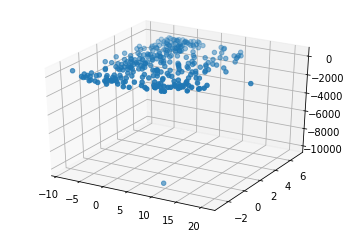
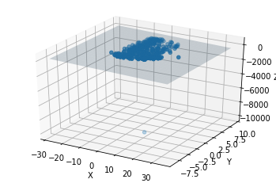

# Moloco Coding Challenge
## Regression Model

Scarlett Hwang

Moloco Data Scientist Position Coding Challenge

November 17th, 2019

Data source: https://docs.google.com/spreadsheets/d/1AV-A1uhQqvF6h0_a-fupFQIHv6W7-vNm88AYh_WzeB0/edit#gid=1326833441


0. Import libraries


```python
from mpl_toolkits import mplot3d
import numpy as np
import pandas as pd  
import matplotlib.pyplot as plt
```

1. Read in the data. Display the first five rows to check the quality.


```python
data = pd.read_csv('reg.csv', sep=',')
data.head(5)
```


<div>
<style scoped>
    .dataframe tbody tr th:only-of-type {
        vertical-align: middle;
    }

    .dataframe tbody tr th {
        vertical-align: top;
    }

    .dataframe thead th {
        text-align: right;
    }
</style>
<table border="1" class="dataframe">
  <thead>
    <tr style="text-align: right;">
      <th></th>
      <th>A</th>
      <th>B</th>
      <th>C</th>
    </tr>
  </thead>
  <tbody>
    <tr>
      <th>0</th>
      <td>0.490</td>
      <td>-0.18</td>
      <td>11.50</td>
    </tr>
    <tr>
      <th>1</th>
      <td>-1.410</td>
      <td>-1.23</td>
      <td>11.80</td>
    </tr>
    <tr>
      <th>2</th>
      <td>0.943</td>
      <td>4.51</td>
      <td>-3.24</td>
    </tr>
    <tr>
      <th>3</th>
      <td>3.570</td>
      <td>5.07</td>
      <td>-23.90</td>
    </tr>
    <tr>
      <th>4</th>
      <td>-1.700</td>
      <td>6.91</td>
      <td>-22.10</td>
    </tr>
  </tbody>
</table>
</div>


2. Create a 3D scatter model of the raw data.

(An outlier is observed near 10 * -2 * -10000.)


```python
fig = plt.figure()
ax = plt.axes(projection="3d")
ax.scatter3D(data.A, data.B, data.C, 'gray')
```


    <mpl_toolkits.mplot3d.art3d.Path3DCollection at 0x119fe8dd8>





3. Create a regression plane.

3.1. Create Alpha matrix for column A and B and beta matrix for the transpose values for column C   


```python
tmp_A = []
tmp_b = []

for i in range(len(data.A)):
    tmp_A.append([data.A[i], data.B[i], 1])
    tmp_b.append(data.C[i])

b = np.matrix(tmp_b).T
A = np.matrix(tmp_A)
```

3.2. Calculate fit and errors to find the residual 


```python
fit = (A.T * A).I * A.T * b
errors = b - A * fit
residual = np.linalg.norm(errors)
```

3.3. Find X limit and Y limit


```python
xlim = ax.get_xlim()
ylim = ax.get_ylim()
```

3.4. Store matrices from the data's X limit and Y limit, create an empty matrix sized the same as X and Y. 


```python
X,Y = np.meshgrid(np.arange(xlim[0], xlim[1]),
                  np.arange(ylim[0], ylim[1]))
Z = np.zeros(X.shape)
```

3.5. Store data to create a regression plane in the empty matrix Z 


```python
for i in range(X.shape[0]):
    for j in range(X.shape[1]):
        Z[i,j] = fit[0] * X[i,j] + fit[1] * Y[i,j] + fit[2]

fig = plt.figure()
ax = plt.axes(projection="3d")

ax.scatter(data.A, data.B, data.C)

ax.set_xlabel('X')
ax.set_ylabel('Y')
ax.set_zlabel('Z')

ax.plot_surface(X,Y,Z, alpha = 0.2)
```


    <mpl_toolkits.mplot3d.art3d.Poly3DCollection at 0x11a9cd5f8>




